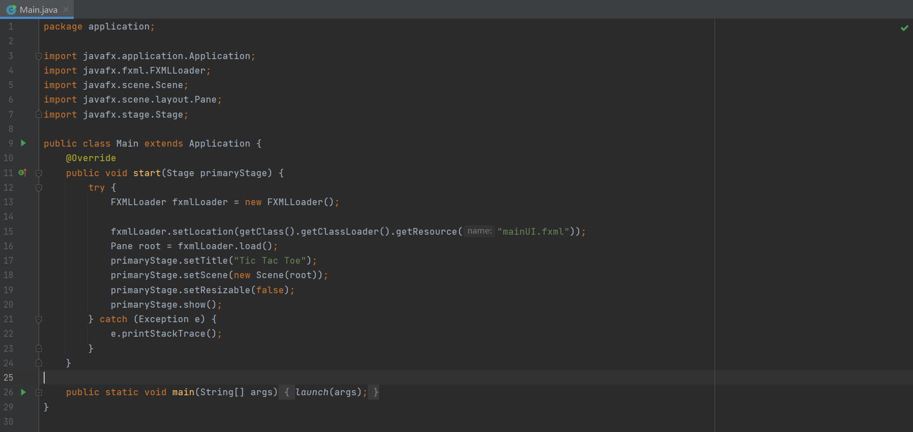
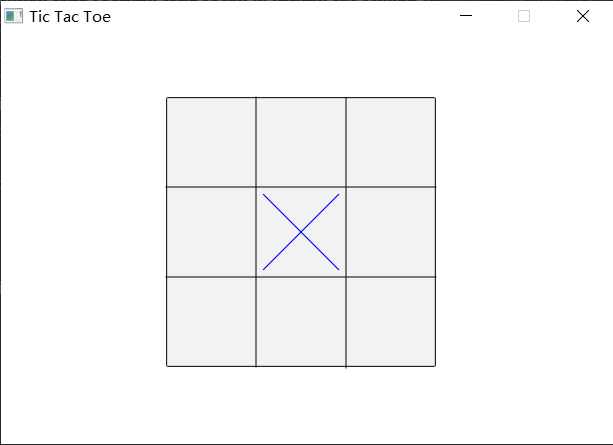
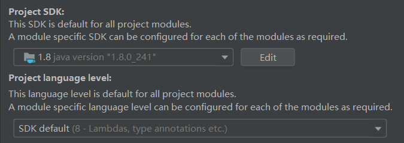
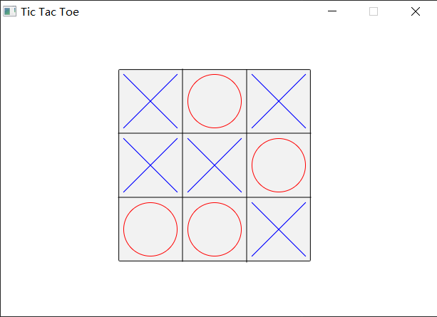

# Assignment 2 Tic-tac-toe Game

This is a template for CS209A-22fall, assignment 2.

## How to start?

### Install

Enter the [github repository ](https://github.com/Sustech-yx/Tic-tac-toe)and [fork](https://github.com/Sustech-yx/Tic-tac-toe/fork) the repo. Clone the repo to your local machine.

### Start the game

The main function entry: `src/application/Main.java`.

Now you can click the chessboard and play the game!

## Java Version

The java version for reference. If you want to use another java language level, maybe there will be something wrong. Feel free to explore!

## Demo View

This is a demo view for the assignment. However, the basic functions are not complete yet. You should do it by yourself!

## TODO

- [ ] Server (35pt.)
- [ ] Client/Player (35pt.)
- [x] GUI (15pt.)
- [ ] Exception Handling (15pt.)
- [ ] Bonus (15pt.)

## Hint

You need to first decouple the view and controller, divide the controller into two components: **client** and **server**, and then use **socket** to communicate between the two components to complete the basic functions.
